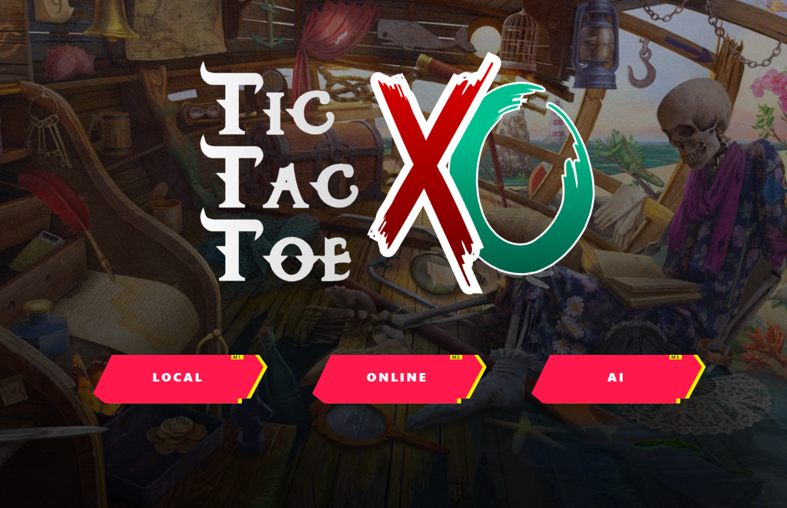
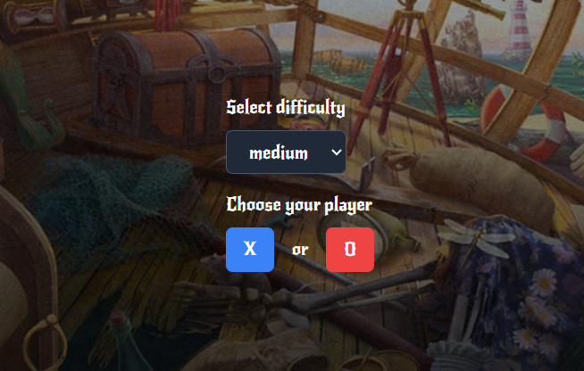

# Tic-Tac-Toe Game (NOT yet completed)


## Live

- [tictactoe-production-f0a0.up.railway.app](https://tictactoe-production-f0a0.up.railway.app/)
- [tic-tac-toe.s1cario.tech:3000](http://tic-tac-toe.s1cario.tech:3000)

## Screenshots




## Table of Contents

1. [Introduction](#introduction)
2. [Features](#features)
3. [Technology Stack](#technology-stack)
4. [Project Structure](#project-structure)
5. [Setup and Installation](#setup-and-installation)
6. [Running the Application](#running-the-application)
7. [API Endpoints](#api-endpoints)
8. [Socket.IO Events](#socketio-events)
9. [Database Schema](#database-schema)
10. [Configuration](#configuration)
11. [License](#license)

## Introduction

This project is a multiplayer Tic-Tac-Toe game implemented using Flask for the backend, Socket.IO for real-time communication, and MongoDB for data persistence. It allows users to register, login, play games against each other in real-time, and track their performance on a leaderboard.

## Features

- User authentication (register, login, logout)
- Real-time multiplayer gameplay
- Leaderboard system
- Game history tracking
- Responsive design for various screen sizes

## Technology Stack

- Backend: Flask (Python)
- Database: MongoDB
- Real-time Communication: Socket.IO
- Frontend: HTML, CSS, JavaScript (details may vary based on your implementation)
- Authentication: Flask sessions
- WSGI Server: Gunicorn
- Web Server: Nginx (for production deployment)

## Project Structure

```text
tic-tac-toe/
│
├── .env
├── .gitignore
├── app.py
├── backend.Dockerfile
├── database.py
├── docker-compose.yml
├── errors.py
├── example-dotenv-file
├── middleware.py
├── requirements.txt
│
├── api/
│ ├── __init__.py
│ ├── routes/
│ │ ├── __init__.py
| | ├── auth_routes.py
| │ └── game_routes.py
| |
| └── utils.py
│
├── models/
│ ├── __init__.py
│ ├── auth.py
│ └── game.py
│
├── multiplayer_socketIO/
│ ├── __init__.py
│ └── events.py
│
├── static/
│ ├── css/
│ ├── js/
│ └── images/
│
├── templates/
│
├── tests/
│ └── socketclient-test.py
|
|
├── config
| ├── __init__.py
│ ├── default.py
│ ├── development
│ └── production
|
└── README.md
```

## Setup and Installation

1. Clone the repository:

   ```sh
   git clone https://github.com/Justxd22/tic_tac_toe.git
   cd tic-tac-toe
   ```

2. Set up a virtual environment:

   ```sh
   python -m venv venv
   source venv/bin/activate  # On Windows use venv\Scripts\activate
   ```

   For me I'm using virtualenvwrapper, It's cool. Give it a try: [virtualenvwrapper](https://pypi.org/project/virtualenvwrapper/)

3. Install the required packages:

   ```sh
   pip install -r requirements.txt
   ```

4. Set up MongoDB:

   - Install MongoDB on your system
   - Initialize it with username and password, if needed.

5. Set up environment variables:
   Create a `.env` file in the root directory to add your env variables. [example file](./server/example-dotenv-file)

## Running the Application

For development:

```sh
python app.py
```

<!-- For production, refer to the [Deployment](#deployment) section. -->

For production, refer to the Deployment section.

## API Endpoints

- POST `/api/auth/register`: Register a new user
- POST `/api/auth/login`: User login
- DELETE `/api/auth/logout`: User logout
<!-- - POST `/api/auth/deregister`: Delete user account
- GET `/api/games`: Get list of games
- POST `/api/games`: Create a new game
- GET `/api/games/<game_id>`: Get game details
- GET `/api/leaderboard`: Get leaderboard -->

## Socket.IO Events

- `connect`: Client connects to the server
- `disconnect`: Client disconnects from the server
- `join_game`: Player joins a game
- `make_move`: Player makes a move
- `game_over`: Game ends (win, lose, or draw)

## Database Schema

### User Collection

- `_id`: ObjectId
- `username`: String
- `email`: String
- `password`: String (hashed)
- `wins`: Integer
- `losses`: Integer
- `draws`: Integer
- `game_played`: Integer
- `score`: Integer
- `created_at`: DateTime
- `avatar`: String (URL)

### Game Collection

- `_id`: ObjectId
- `player1`: ObjectId (ref: User)
- `player2`: ObjectId (ref: User)
- `board`: Array
- `current_turn`: ObjectId (ref: User)
- `winner`: ObjectId (ref: User)
- `is_draw`: Boolean
- `status`: String
- `created_at`: DateTime
- `end_at`: DateTime

### Leaderboard Collection

- `_id`: ObjectId
- `user_id`: ObjectId (ref: User)
- `wins`: Integer
- `draws`: Integer
- `score`: Integer

## Configuration

Configuration settings are managed in `config.py`. Different configurations are available for development, testing, and production environments.

## Authors

- Noor Amjad - [GitHub](https://github.com/Justxd22) / [Twitter](https://twitter.com/_xd222) / [LinkedIn](https://www.linkedin.com/in/noor-amjad-xd)
- Amr Abdelfattah - [GitHub](https://github.com/0x3mr) / [Twitter](https://twitter.com/an0n_amr) / [LinkedIn](https://www.linkedin.com/in/amrabdelfattah/)
- Ahmed Shalaby - [GitHub](https://github.com/Madiocre) / [Twitter](https://twitter.com/Ahmed_K_Shalaby) / [LinkedIn](https://www.linkedin.com/in/ahmed-shalaby-31a03a235/)
- Ahmed Aboalesaad - [GitHub](https://github.com/Ahmed-Aboalasaad) / [Twitter](https://x.com/Aboalesaad_) / [LinkedIn](https://www.linkedin.com/in/ahmed-aboalesaad/)
- Abdelrahman Mohamed - [GitHub](https://github.com/hackerSa3edy) / [Twitter](https://x.com/hackersa3edy) / [LinkedIn](https://linkedin.com/abdelrahmanm0)
- Kedir Jabir - [GitHub](https://github.com/IbnuJabir) / [Twitter](https://x.com/Ibnu_J1) / [LinkedIn](https://www.linkedin.com/in/ibnu-jabir/)

## License

Copyright (C) 2024
Licensed under the GPLv3 License
